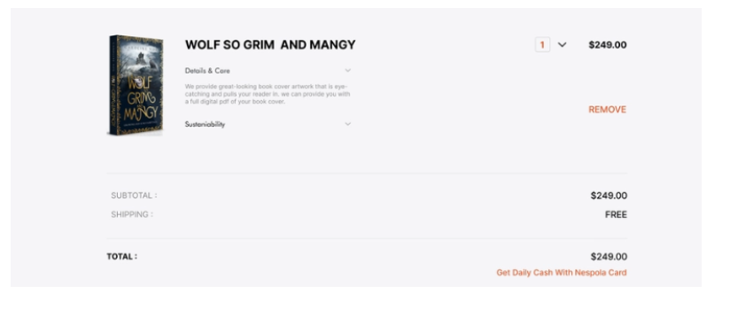
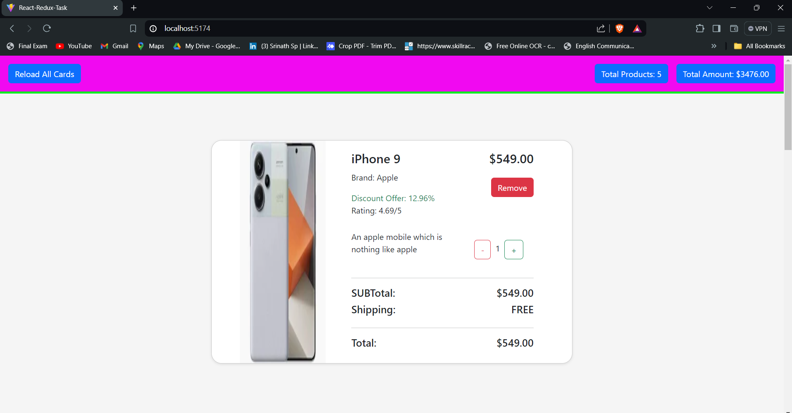

### React Redux Task

**Task Description**

 - https://drive.google.com/file/d/1fOadeM1liwbUK38z92F0XYugk2jwqK2r/view?usp=share_link

 - From the above link get a JSON data and create a cart page with per-item price, per-item quantity,
Total quantity and total amount

**Functionalities Required**

 - Needs to Increase or Decrease the per unit Quantity that should automatically updates the total Quantity and Amount.

 - Code Must Use Only React Redux Toolkit  to perform all necessary functions
  
**For Reference**

  

 **Description**
   
   * In [Index.html](./index.html)
      
      - This is an HTML document that sets up a basic web page with React and Bootstrap, including a root element for the React application and scripts to load Bootstrap and the React application.
   
   * In [App.jsx](/src/App.jsx) 
     
      - **Setting Up the Redux Store**: The `App` component wraps the entire application with the Redux `Provider` component, passing the `store` as a prop. This setup ensures that the Redux store is available throughout the application, enabling state management and access to the store in any component.
      - **Rendering Component `B`**: Within the Redux `Provider`, the `App` component renders the `B` component, which is expected to connect to the Redux store and manage its state accordingly. This structure supports centralized state management and facilitates the flow of data across different parts of the application.

   * In [productSlice.jsx](/src/slices/productSlice.jsx)  

      - **Initial State**: The `initialState` object defines the default state for the slice, including an empty array for `products`, and initial values of 0 for `totalCardCount` and `totalAmount`.
      - **Reducers**: The `productSlice` object contains multiple reducers:
       
           - `setProducts`: Updates the `products` array and recalculates `totalCardCount` and `totalAmount` based on the new products.
           - `updateTotalCardCount`: Adjusts the `totalCardCount` by the given payload.
           - `updateTotalAmount`: Adjusts the `totalAmount` by the given payload.
           - `removeProduct`: Removes a product by ID, and recalculates `totalCardCount` and `totalAmount`.
           - `updateProductQuantity`: Updates the quantity of a specific product identified by its ID.

      - **Action Creators**: By using `createSlice`, action creators corresponding to each reducer are automatically generated. These actions can be dispatched to update the state managed by this slice.

      - **Export**: The slice's reducer is exported as the default export, which can be integrated into the Redux store. The action creators are also exported for use in dispatching actions to modify the state.
    
   * In [store.jsx](/src/store/store.jsx)

      - The `store` is configured using `configureStore` from Redux Toolkit, integrating the `productReducer` to manage the state under the `products` slice, providing a centralized and efficient state management setup for the application.

   * In [B.jsx](/src/components/B.jsx

      - The `B` component fetches product data from `/product.js` on mount, dispatches the `setProducts` action to update the Redux store with the fetched data, and renders the `CardData1` component to display the products.

   * In [product.js](/public/product.js) 

      - This JSON array contains a list of product objects, each detailing various attributes of smartphones including id, title, description, price, discount percentage, rating, stock, brand, category, thumbnail, and image URLs.

   * In [CardData.jsx](/src/components/carddata1.jsx) 

      - **Redux Integration**: The `CardData1` component utilizes `useSelector` from React Redux to select and extract state values (`products`, `totalCardCount`, `totalAmount`) from the Redux store. This allows the component to access and render these values directly from the centralized state management provided by Redux.
      - **Component Structure**: The component renders a `NavBar` component to display summary information (`totalCardCount` and `totalAmount`). It also maps through the `products` array obtained from the Redux store and renders a `Card` component for each product, passing down necessary props such as `key` and `product`. This structure ensures that the component efficiently displays and manages the UI based on the current state stored in Redux.

   * In [Card.jsx](/src/components/card.jsx) 

      - **State Management with `useState` and `useEffect`:** 
            
           - The component uses `useState` to manage the `quantity` of the product, initializing it with `product.quantity` or 1 if not provided.
             
           - `useEffect` is employed to update the Redux store with the current `quantity` whenever it changes. It dispatches `updateProductQuantity` action with the product ID and new quantity.
             
      - **Quantity Control Handlers:**
            
           - `increaseQuantity`: Increases the `quantity` state by 1 when the corresponding button is clicked. It dispatches `updateTotalCardCount` to update the total count of items and `updateTotalAmount` to increase the total amount based on the product's price.
             
           - `decreaseQuantity`: Decreases the `quantity` state by 1 if the current quantity is greater than 1. It dispatches `updateTotalCardCount` to decrease the total count of items and `updateTotalAmount` to decrease the total amount based on the product's price.

      - **Rendering Product Information:**
           
           - Displays the product's image, title, price, brand, discount percentage, rating, and description.
            
           - Provides a button to remove the product from the cart, which dispatches `removeProduct` action with the product ID.

      - **Calculating Prices:**
           - Computes the subtotal by multiplying the product's price with the current `quantity`.
            
           - Displays the subtotal and total amounts, assuming shipping is free, using the calculated subtotal.

      - **CSS Styling:**
           - Uses CSS classes (`container`, `card-body`, `top`, `top-header`, `quantity-btn`, etc.) to structure and style the card layout, ensuring a visually appealing and organized presentation of product information and controls.

   * In [Card.css](/src/components/card.css)  

      - This CSS styles the body with a whitesmoke background, defines a flexible, centered container with a shadow and rounded borders, and styles cards with hover effects, specific dimensions, and structured content, including image and text formatting.
       
   * In [Navbar.jsx](/src/components/Navbar.jsx)      

      - **Redux Integration:**
           - The component utilizes `useSelector` from React Redux to retrieve `totalCardCount` and `totalAmount` from the Redux store's `products` slice. This allows the `NavBar` to display real-time information about the number of products in the cart and the total amount.

      - **Reload Functionality:**
           - The `handleRefreshPage` function is triggered when the "Reload All Cards" button is clicked. It simply reloads the current page using `window.location.reload()`. This action can be used to reset or refresh the application state if needed.

      - **UI and Styling:**
           - The `NavBar` component renders a navigation bar (`nav` element) with a container (`navbar-container`) and styled buttons (`btn btn-primary`) to display total product count and total amount. The styling is defined in an external CSS file (`Navbar.css`), ensuring consistent appearance and layout across the application.

   * In [Navbar.css](/src/components/Navbar.css)    

      - CSS for a fixed-positioned navigation bar with space-between alignment, displaying total product count and amount, ensuring a consistent layout and appearance.

 **Steps to run this code:** 
  
  1. Set up a React development environment on your local machine if you haven't already. You can do this by installing Node.js and npm, and then using Create React App or setting up a React project manually.

  2. Create the necessary file structure for your project, including the `src` folder for your React components and other source files.

  3. Copy the provided React components and CSS styles into your project files. Ensure that the file paths and imports are correctly set up.

  4. Install any dependencies required by the project, such as `"react": "^18.2.0"` and ` "react-dom": "^18.2.0"` and `"react-router-dom": "^6.23.1"`and `npm install @reduxjs/toolkit react-redux` by running `npm install` in your project directory.

  5. Once everything is set up, you can start your development server by running `npm run dev` in your project directory. This command will compile your React code and start a development server, typically running on `http://localhost:5174/`, where you can view your application in a web browser.

  6. If you're using any external resources or APIs, make sure they are accessible and correctly configured in your code.

  7. Finally, open your web browser and navigate to `http://localhost:5174/` (or the appropriate address if your development server is running on a different port) to see your React application in action.

 Remember to make any necessary adjustments to fit your specific project setup, such as configuring routes, managing state, and connecting to backend services if needed.

  **Output:**
       
   

**future enhancements:**
    
    Implement real-time updates using WebSockets for instant product changes and notifications.